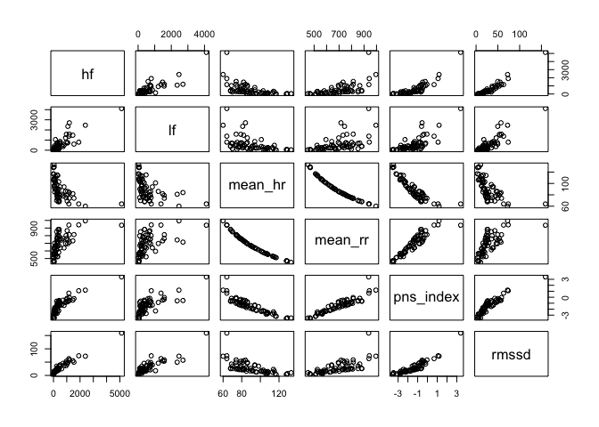

<!-- README.md is generated from README.Rmd. Please edit that file -->

# athletes

<!-- badges: start -->
<!-- badges: end -->

The goal of `athletes` is to provide the tools and data used for the IND
athletes dataset, which contains data from 31 subjects.

## Installation

You can install the development version of athletes like so:

``` r
# install.packages("remotes")
remotes::install_github("matcasti/athletes")
```

## Example

This is a basic example which shows you how to call the dataset:

``` r
library(athletes)

head(ind[, 1:8]) # First six observations from the first eight columns
#>    id time  hf  lf mean_hr mean_rr pns_index rmssd
#> 1:  1  Pre 417 295      76     790     -1.02  25.5
#> 2:  1 Post 102 202      95     634     -2.14  13.5
#> 3:  2  Pre 169 213      91     661     -1.84  19.3
#> 4:  2 Post 135 260     113     531     -2.80  12.6
#> 5:  3  Pre 242 148      70     852     -0.66  25.8
#> 6:  3 Post  60 221      96     626     -2.23  12.3
```

Lets check the mean values of key HRV metrics for each time point:

``` r
ind[, lapply(.SD, mean), .SDcols = 5:8, keyby = time]
#>    time  mean_hr  mean_rr  pns_index    rmssd
#> 1:  Pre 80.48387 760.6129 -0.9883871 33.22258
#> 2: Post 99.83871 620.9032 -1.9254839 25.57774
```

You can also plot the data using the classic base-r system:


